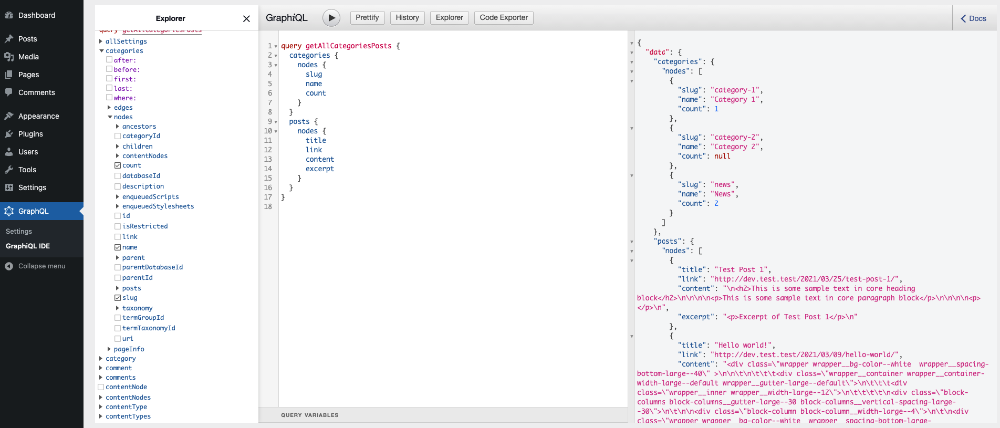

WordPress REST API can be extended to support [GraphQL](https://graphql.org/). GraphQL is a query language for your API and it acts as a separate layer between the WordPress REST API and the application using data from the API.

With GraphQL we are enabling apps to define their own queries and what data will be retrieved from the API. GraphQL queries allow getting data from multiple resources at once, which is a big plus over the standard REST API way. With REST API you'd either have multiple routes and send requests to each one individually, or have a monolithic route that will already contain all the resources that you may need.

### GraphQL in WordPress

GraphQL in WordPress can be enables via [WPGraphQL plugin](https://www.wpgraphql.com/). It is a free plugin, hosted on the WordPress plugin repository. It comes with a pretty useful GraphiQL tool that allows you to preview GraphQL schema and test out some queries.


To test the queries click on resources in the left sidebar. You can drill down in their structure and see what is available. For example, to get all posts and show their title, link, excerpt and content, the query would look like this:

```graphql
query getAllPosts {
  posts {
    nodes {
      title
      link
      excerpt
      content
    }
  }
}
```


To combine multiple resources in one query you can keep selecting resources the in the sidebar or add them in the query editor. For this example we will query all post categories and all posts.



This is just a start of interacting with GraphiQL and more examples and guides can be found in plugins [documentation](https://www.wpgraphql.com/docs/).

Apps that will use WordPress GraphQL API will need to send HTTP POST requests to the GraphQL endpoint and provide the query in request body. WPGraphQL plugin registers this endpoint and by default it is `http://your-domain.com/graphql/`.

To grasp some basic GraphQL concepts, read these chapters from the WPGraphQL documentation:
* [Intro to GraphQL](https://www.wpgraphql.com/docs/intro-to-graphql/)
* [WPGraphQL Concepts](https://www.wpgraphql.com/docs/wpgraphql-concepts/)

### Adding new resources to WordPress GraphQL

You can register new GraphQL types or add new fields to the existing GraphQL types.

#### Adding new GraphQL post and taxonomy type

To add a custom post or a taxonomy types to the GraphQL schema you need to provide additional arguments to the register functions.

```php
[
	// ... other post type or taxonomy arguments
	'show_in_graphql' => true,
	'graphql_single_name' => 'singleName',
	'graphql_plural_name' => 'pluralName',
	// ... other post type or taxonomy arguments
]
```

To add or remove post types or taxonomies that are created by default or by a third-party plugins, you will need to use [register_post_type_args](https://developer.wordpress.org/reference/hooks/register_post_type_args/) or [register_taxonomy_args](https://developer.wordpress.org/reference/hooks/register_taxonomy_args/) filter and return modified arguments array.

GraphQL will use the single and plural names to register new GraphQL [types](https://graphql.org/learn/schema/#type-system) which will be used in queries.

#### Adding a new GraphQL type

WPGraphQL comes with a lot of registered types and you can use them to register more complex fields. Most of the time you'll use [scalar](https://www.wpgraphql.com/docs/default-types-and-fields/#scalars) (simple) types but you can register your own custom types. You can learn more about this in the [documentation](https://www.wpgraphql.com/docs/default-types-and-fields).

To register your own custom type for a field that needs to provide multiple values you will need to use [register_graphql_object_type](https://www.wpgraphql.com/functions/register_graphql_object_type/) inside the callback of [graphql_register_types](https://www.wpgraphql.com/actions/graphql_register_types/) action. You will need to provide a unique name for this new type and scalar fields that will be contained in this object type.


#### Adding new GraphQL fields

To add additional fields to the registered types you can use [register_graphql_fields](https://www.wpgraphql.com/functions/register_graphql_fields/) or [register_graphql_field](https://www.wpgraphql.com/functions/register_graphql_field/) functions inside the callback of [graphql_register_types](https://www.wpgraphql.com/actions/graphql_register_types/) action.

```php
add_action( 'graphql_register_types', [$this, 'register_field']);

protected function register_field() {
	if (function_exists('register_graphql_field')) {
		register_graphql_field(
			'Post', // Name of the GraphQL type.
			'testPostField', // Name of the new field.
			[
				'type' => 'String', // Type of the new field.
				'description' => __( 'Example field added to the Post Type','your-textdomain' ), // Description of the new field.
				'resolve' => function($post, $args, $context, $info) { // Callback function that return the value of the field.
					return \get_post_meta($post->ID, 'meta_field_key');
				}
			]
		);
	}
}
```

The example above is for the field that returns a string value. You can register fields that will return more complex value. For example, you want to register image field that will return values of multiple images. For each image you will have URL of the image and the alt text.

To do that you need to first register a custom image type (remember that name must be unique) that will have two sub-fields: URL and alt text. In `register_graphql_field` function you will define a type of field as a list of image fields.

```php
add_action( 'graphql_register_types', [$this, 'register_field']);

protected function register_field() {
	if (function_exists('register_graphql_object_type')) {
		register_graphql_object_type(
			'customImage',
			[
				'fields' => [
					'imageURL' => [
						'type' => 'String',
						'description' => esc_html__('URL of the image', 'your-textdomain'),
					],
					'imageAlt' => [
						'type' => 'String',
						'description' => esc_html__('alt value of the image', 'your-textdomain'),
					],
				],
			]
    );
  }

	if (function_exists('register_graphql_field')) {
		register_graphql_field(
			'Post', // Name of the GraphQL type.
			'testPostField', // Name of the new field.
			[
				'type' => ['list_of' => 'customImage'], // Type of the new field registered as a list of images.
				'description' => __( 'Example field added to the Post Type', 'your-textdomain' ), // Description of the new field.
				'resolve' => function($post) { // Callback function that return the value of the field.
					$images = [];
					$imagesArray = \get_post_meta($post->ID, 'meta_field_key');

					foreach ( $imagesArray as $imageItem ) {
						$images[] = [
							'imageURL' => $imageItem['image_url'] ?: '',
							'imageAlt' => $imageItem['alt_text'] ?: '',
						];
					}

					return $images;
				}
			]
		);
	}
}
```
